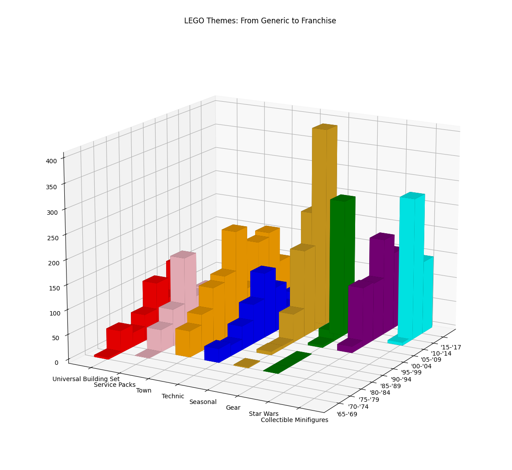
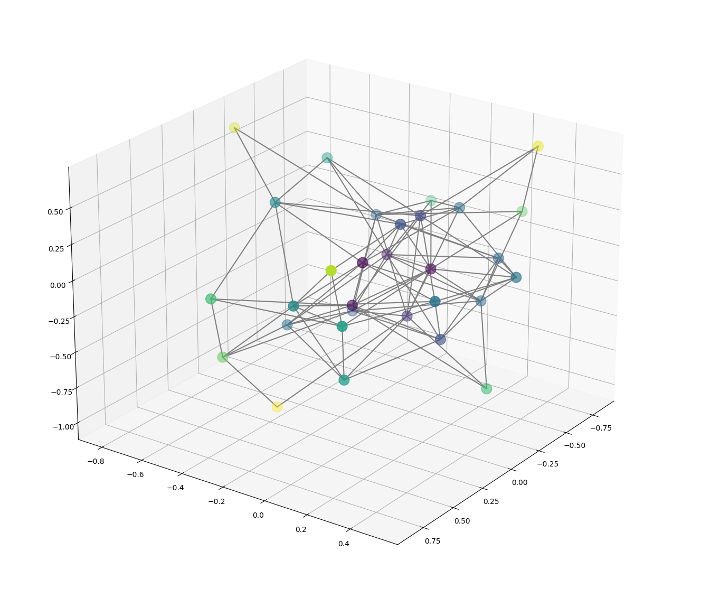
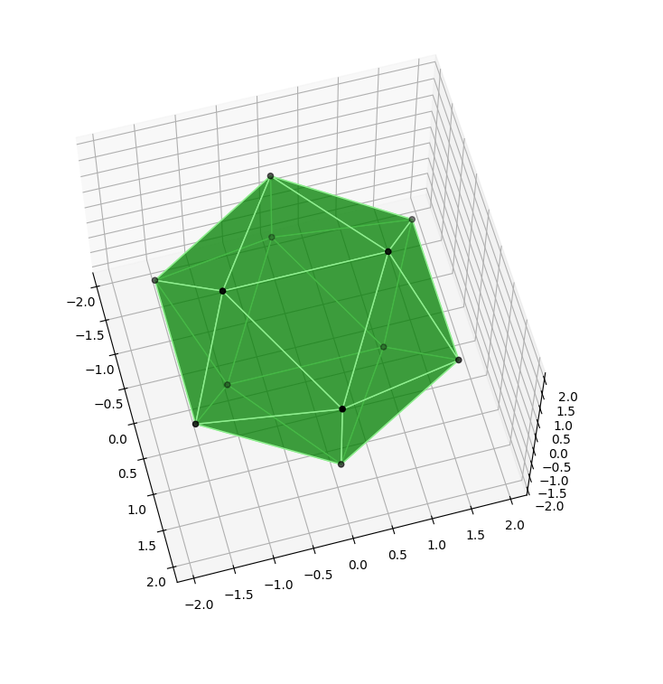

# Making 3D graphs, charts, and figures with Python

This is the companion repo to [this post](https://seeinglogic.com/posts/python-3d-intro/) on making basic 3D visuals with Python.

Check out the [Jupyter Notebook](./demo_notebook.ipynb) for a more interactive experience.

Otherwise you can find each of the three visuals in the corresponding directories.

|  [Making 3D Bar Charts with matplotlib](./bar_charts/) |  [Network Graphs in 3D with networkx and matplotlib](./network_graphs/) |    [Rendering a regular icosahedron with matplotlib](./icosahedron/) |
|-|-|-|

If you like this, check out my other work and keep up with me on
[Twitter](https://twitter.com/seeinglogic) or
[Mastodon](https://infosec.exchange/@seeinglogic).
